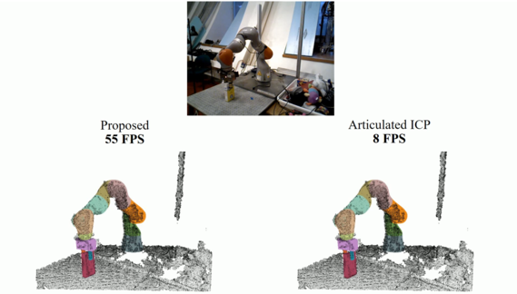

# [FilterReg](<https://sites.google.com/view/filterreg/home>)

FilterReg is a geometric point-set registration algorithm. By leveraging Gaussian Filter for correspondence search and twist parametrization for kinematic computation, it achieves state-of-the-art robustness and efficiency.

This repository contains a reference implementation of FilterReg and other geometric processing algorithms. This code aims at real-time tracking and geometric processing for robotic manipulation, visual odometry and SLAM (3D Reconstrution).

### Video Demo [[Link]](https://youtu.be/k-YQVZfM0qg)

### Project Page, Paper and Supplemental Document

Project Page: [Link](<https://sites.google.com/view/filterreg/home>)

Paper: [PDF](https://drive.google.com/file/d/1XLCAwkIRqnHFhYMx6hYf8LxN_IeozliZ/view?usp=sharing) [ArXiv](https://arxiv.org/abs/1811.10136)

Supplemental Document: [PDF](https://drive.google.com/file/d/1R_E-v3vh7aq3uwg_EOmZEtItMn649rVI/view?usp=sharing)

### Build Instruction

The code is developed on Ubuntu 16.04 with `CUDA-9` and `CUDA-10`. The tested compilers are `gcc-5.4` and `gcc-6.0`. Note that `gcc-5.5` is not supported by CUDA and may cause errors.

You need to install `pcl` and `opencv`. The default versions of both Ubuntu 16.04 and `ros-kinetic` have been tested.

Several other utilies

Now you are ready to build

Quick start

### TODO

The code is re-factored from a pretty messy version which is the backbone of all the experiments in our paper. Not all the code has been adapted into this repository and the author is working on it.

- [ ] The GPU implementation of various algorithms
- [ ] Revive the articulated kinematic model using the new MultiBodyTree in drake
- [ ] The deformable kinematic model used in SurfelWarp